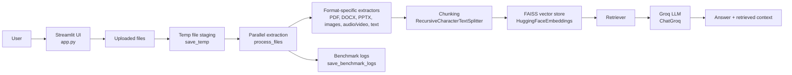

# Docex

**Fast AI document brain for multi-format document ingestion, parallel
extraction, vector search, and Groq-powered RAG Q&A.**

<p align="left">
  
  
  
  
  
  
</p>

## Overview

Docex is a Streamlit application that turns uploaded documents into a searchable
knowledge base. It extracts text from multiple file types, chunks the content,
builds a FAISS vector store with Hugging Face embeddings, and answers questions
using a Groq-hosted LangChain retrieval chain.

The current implementation focuses on speed and broad file support. Extraction
runs in parallel, progress is reported in the UI, and benchmark logs can be
saved locally for later inspection.

## Architecture



## Features

- Upload and process multiple files in one session.
- Parallel file extraction with per-file and overall progress updates.
- Support for PDFs, DOCX, PPTX, images, plain text, and common media files.
- OCR-based image extraction via Tesseract.
- Audio/video transcription via Whisper + FFmpeg preprocessing.
- FAISS-based vector search with Hugging Face embeddings.
- Groq-backed retrieval-augmented generation for document Q&A.
- Optional benchmark log export to `docex_benchmarks.json`.

## Tech Stack

### Application

- Python
- Streamlit
- LangChain
- FAISS
- Hugging Face sentence-transformer embeddings
- Groq LLM inference

### Document Processing

- PyMuPDF for PDFs
- python-docx for DOCX
- python-pptx for PPTX
- Pillow + pytesseract for OCR
- Whisper + FFmpeg for audio/video transcription
- textract and Unstructured as fallbacks

## Supported Inputs

Docex currently handles these extensions in the main extraction path:

- Documents: `.pdf`, `.docx`, `.pptx`
- Images: `.png`, `.jpg`, `.jpeg`, `.bmp`, `.tiff`
- Text: `.txt`, `.md`, `.csv`, `.json`
- Audio/video: `.mp3`, `.wav`, `.m4a`, `.flac`, `.mp4`, `.mov`, `.avi`

If a specialized extractor fails, the app falls back to `textract` and then
`UnstructuredFileLoader` when available.

## Project Structure

- `app.py` - Streamlit UI, session state, extraction flow, vector DB creation,
  and RAG querying.
- `rag_utils.py` - File saving, file type detection, extraction, chunking, FAISS
  indexing, and RAG chain construction.
- `aud_vid_utils.py` - Fast audio/video transcription using Whisper and FFmpeg
  preprocessing.
- `settings.py` - Environment loading and `GROQ_API_KEY` access.
- `requirements.txt` - Python dependencies.

## Prerequisites

This project depends on a few system-level tools in addition to Python packages:

- Python 3.10 or newer.
- FFmpeg available on the system PATH for audio/video preprocessing.
- Tesseract OCR installed and available on the system PATH for image text
  extraction.
- A valid Groq API key.

## Installation

1. Clone the repository.
2. Create and activate a virtual environment.
3. Install the Python dependencies:

```bash
pip install -r requirements.txt
```

4. Create a `.env` file in the project root and add your Groq API key:

```env
GROQ_API_KEY=your_groq_api_key_here
```

## Run The App

Start the Streamlit app with:

```bash
streamlit run app.py
```

Open the local URL shown in the terminal, upload documents, then:

1. Wait for extraction to finish.
2. Click `Build Vector DB`.
3. Ask a question in the text box and run the RAG query.

## How It Works

1. Uploaded files are written to temporary local paths.
2. `process_files()` extracts each file in parallel and chunks the text.
3. The app builds a FAISS index from the extracted chunks.
4. `build_rag_chain()` creates a retrieval chain using `ChatGroq`.
5. The user’s prompt is answered using only the retrieved context.

## Outputs

- On-screen extraction progress for each file.
- Overall progress updates during parallel processing.
- Vector database build timings.
- Optional benchmark log file: `docex_benchmarks.json`.

## Notes

- The app keeps extracted chunks and the retriever in Streamlit session state
  during the current session.
- The extraction path is designed for broad compatibility, but some formats
  still depend on optional packages being installed.
- If OCR or transcription is required, make sure the system-level tools
  mentioned above are installed correctly.

## Troubleshooting

- If image extraction fails, verify that Tesseract is installed and on PATH.
- If audio or video transcription fails, verify that FFmpeg is installed and
  accessible.
- If Groq responses fail, confirm that `GROQ_API_KEY` is set in `.env` and that
  the key is valid.
- If a file type falls back unexpectedly, ensure the optional Python packages
  for that format are installed.

## License

No license file is included in this repository.
